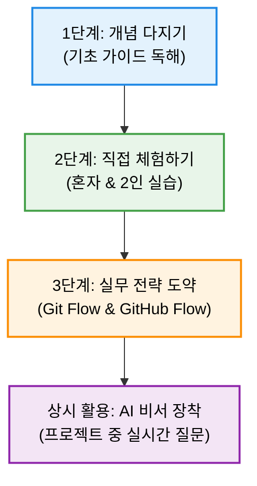

# 🚀 Git & GitHub 협업 마스터 클래스

이 저장소는 Git을 처음 접하는 초보자, 비전공자, 그리고 대학생 팀 프로젝트를 준비하는 분들을 위한 **실무 중심의 Git/GitHub 가이드 및 실습 패키지**입니다. 

단순한 이론 공부를 넘어, 팀 프로젝트에서 일어날 수 있는 에러들을 예방하고 직접 해결할 수 있도록 단계별 로드맵을 제공합니다.

---

## 🗺️ 권장 학습 순서 (Roadmap)

가장 빠르고 효과적으로 Git 협업을 배우려면 아래 4단계 로드맵을 순서대로 진행해 주세요.

### 📋 단계별 학습 리스트

| 단계 | 학습 목표 | 대상 문서 | 주요 학습 내용 |
| :---: | :--- | :--- | :--- |
| **1** | **Git 개념 및 필수 명령어 익히기** | 📄 [Git 기초 가이드](./git_github_tutorial.md) | • Git의 4대 작업 영역 및 라이프사이클 • Git 최초 설정 (사용자 등록) • 혼자 작업할 때 쓰는 6대 필수 명령어 • 민감 정보 업로드 제외하기 (`.gitignore`) |
| **2** | **브랜치 협업 및 충돌 직접 해결하기** | 📄 [실전 실습 가이드](./git_practice_lab.md) | • **Track 1 (1인)**: 브랜치 병합 및 강제 충돌 직접 해결하기 • **Track 2 (2인)**: 동료 초대, 동시 작업, 실제 PR 생성 및 머지 • VS Code / 메모장 / Vim 각 환경별 충돌 해결 방법 |
| **3** | **실무 브랜치 전략 선택 및 도입** | 📄 [Git Flow 완벽 가이드](./git_flow_guide.md) | • 실무 정기 배포용 **Git Flow** 모델 (5개 브랜치 흐름) • 웹 스타트업 수시 배포용 **GitHub Flow** 모델 • 우리 팀 규모에 맞는 전략 비교 분석 |
| **상시** | **프로젝트 진행 중 실시간 서포트** | 📄 [LLM Git 협업 비서](./git_assistant_skill.md) | • ChatGPT/Gemini/Claude에 주입 가능한 프롬프트 템플릿 • 나만의 24시간 안전한 Git 트러블슈팅 멘토 장착 |

---

## 🚨 초보자 단골 에러 트러블슈팅 요약

프로젝트를 진행하다가 막힐 때는 [Git 기초 가이드](./git_github_tutorial.md#-실전-협업-에러-시나리오-5선-및-대처법)의 에러 시나리오 파트를 찾아보세요.

* **시나리오 1**: 같은 파일을 수정해서 충돌(Conflict)이 났을 때 ➔ [해결법 보기](./git_github_tutorial.md#-시나리오-1-같은-파일을-수정해서-충돌conflict이-났을-때)
* **시나리오 2**: 깜빡하고 `main` 브랜치에서 직접 작업/커밋해버렸을 때 ➔ [해결법 보기](./git_github_tutorial.md#-시나리오-2-깜빡하고-main-브랜치에서-직접-코드를-수정해버렸을-때)
* **시나리오 3**: `git pull`을 안 하고 작업 후 push했다가 거절당했을 때 ➔ [해결법 보기](./git_github_tutorial.md#-시나리오-3-git-pull을-안-하고-수정한-뒤-push-하려다가-거부당했을-때)
* **시나리오 4**: 이미 GitHub에 push까지 완료한 실수를 되돌려야 할 때 ➔ [해결법 보기](./git_github_tutorial.md#-시나리오-4-이미-github에-push한-커밋을-되돌려야-할-때)
* **시나리오 5**: 실수로 `-m` 없이 `git commit`을 쳐서 Vim 화면에 갇혔을 때 ➔ [해결법 보기](./git_github_tutorial.md#-시나리오-5-실수로--m-없이-git-commit을-쳐서-이상한-화면vim에-갇혔을-때)
