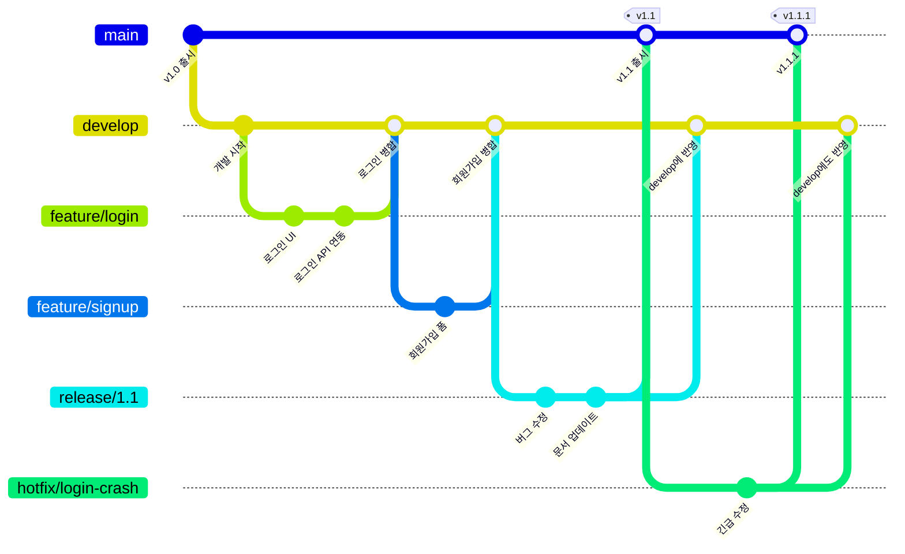
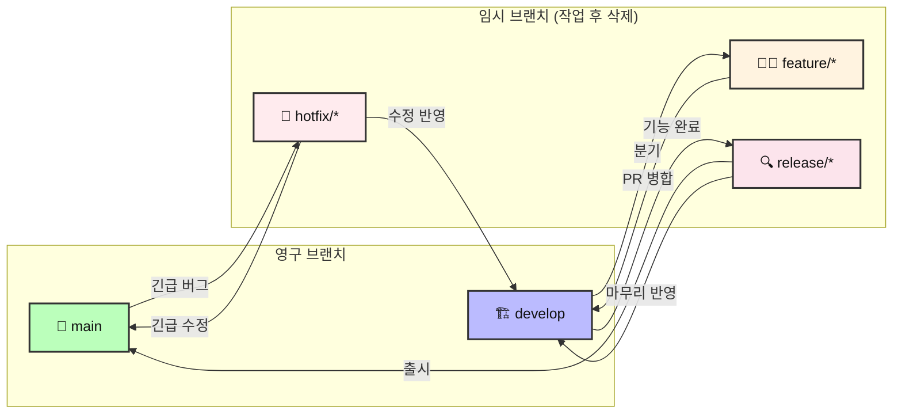

# 🌊 Git Flow 완벽 가이드: 실무 브랜치 전략

> **난이도**: 중급 (기본 Git 명령어를 알고 있는 분 대상)
> **선수 조건**: [Git & GitHub 협업 가이드](./git_github_tutorial.md) 실습 완료

---

## Git Flow란?

Git Flow는 2010년 Vincent Driessen이 제안한 **브랜치 관리 모델**로, 대규모 팀에서 개발·테스트·배포를 체계적으로 관리하기 위해 설계되었습니다.

핵심 아이디어는 **"브랜치마다 명확한 역할을 부여하고, 코드가 흘러가는 방향을 고정하는 것"**입니다.



---

## 5가지 브랜치 상세 설명

### 1. 🏪 `main` — 출시 전용 브랜치

* **규칙**: 이 브랜치의 모든 커밋은 곧 **배포 가능한 버전**입니다.
* **직접 커밋 금지**: `release` 또는 `hotfix`를 통해서만 병합됩니다.
* **태그(Tag)**: 병합할 때마다 `v1.0`, `v1.1` 같은 버전 태그를 붙입니다.

---

### 2. 🏗️ `develop` — 개발 통합 브랜치

* **역할**: 다음 출시 버전에 들어갈 모든 기능을 모으는 곳입니다.
* **분기 기준**: 모든 `feature` 브랜치는 여기서 나가고 여기로 돌아옵니다.
* `main`과 함께 **영구적으로 유지**되는 브랜치입니다.

#### 초기 설정
```bash
# main에서 develop 브랜치 생성 (프로젝트 시작 시 1회만)
git switch main
git switch -c develop
git push origin develop
```

---

### 3. 🧑‍💻 `feature/*` — 기능 개발 브랜치

* **분기**: `develop`에서 생성
* **병합**: 완료 후 `develop`으로 병합
* **삭제**: 병합 후 삭제
* **명명 규칙**: `feature/login`, `feature/dark-mode` 등

#### 전체 흐름
```bash
# 1. develop을 최신화한 뒤 feature 브랜치 생성
git switch develop
git pull origin develop
git switch -c feature/login

# 2. 기능 개발 (파일 수정, 추가 등)
# ... 코딩 작업 ...

# 3. 커밋
git add .
git commit -m "feat: 로그인 페이지 구현"

# 4. GitHub에 올리기
git push origin feature/login

# 5. GitHub에서 PR 생성 (base: develop, compare: feature/login)

# 6. PR 승인 후 로컬 정리
git switch develop
git pull origin develop
git branch -d feature/login
```

---

### 4. 🔍 `release/*` — 출시 준비 브랜치

* **분기**: `develop`에서 생성 (기능 개발 완료 후)
* **병합**: `main`과 `develop` **양쪽 모두**에 병합
* **용도**: 버전 번호 수정, 사소한 버그 수정, 문서 정리 등 출시 직전 마무리 작업
* **이 브랜치에서 새 기능 추가 금지!**

#### 전체 흐름
```bash
# 1. develop에서 release 브랜치 생성
git switch develop
git pull origin develop
git switch -c release/1.1

# 2. 출시 전 마무리 작업 (버그 수정, 버전 번호 업데이트 등)
git add .
git commit -m "chore: v1.1 버전 번호 업데이트"

# 3. main에 병합하고 태그 붙이기
git switch main
git merge release/1.1
git tag v1.1
git push origin main --tags

# 4. develop에도 병합 (마무리 수정사항 반영)
git switch develop
git merge release/1.1
git push origin develop

# 5. release 브랜치 삭제
git branch -d release/1.1
```

---

### 5. 🚒 `hotfix/*` — 긴급 수정 브랜치

* **분기**: `main`에서 생성 (출시 후 치명적 버그 발견 시)
* **병합**: `main`과 `develop` **양쪽 모두**에 병합
* **특징**: `develop`을 거치지 않고 **main에서 바로 분기**하는 유일한 브랜치

#### 전체 흐름
```bash
# 1. main에서 hotfix 브랜치 생성
git switch main
git pull origin main
git switch -c hotfix/login-crash

# 2. 긴급 수정
git add .
git commit -m "fix: 로그인 시 앱 크래시 수정"

# 3. main에 병합하고 태그 붙이기
git switch main
git merge hotfix/login-crash
git tag v1.0.1
git push origin main --tags

# 4. develop에도 병합 (수정사항 반영)
git switch develop
git merge hotfix/login-crash
git push origin develop

# 5. hotfix 브랜치 삭제
git branch -d hotfix/login-crash
```

> [!WARNING]
> hotfix를 develop에 병합하는 것을 잊으면, 다음 출시에서 같은 버그가 다시 살아납니다! 양쪽 병합을 반드시 지켜주세요.

---

## 코드 흐름 요약 다이어그램



---

## Git Flow vs 다른 브랜치 전략 비교

| 항목 | Feature Branch (현재 팀) | Git Flow | GitHub Flow |
|---|---|---|---|
| 브랜치 수 | 2개 (`main`, `feature`) | 5종류 | 2개 (`main`, `feature`) |
| 복잡도 | ⭐ | ⭐⭐⭐ | ⭐ |
| 적합한 팀 | 소규모 / 학습 | 대규모 / 정기 배포 | 소규모 / 지속 배포 |
| 배포 방식 | 수동 | 릴리스 주기 | PR 머지 시 자동 배포 |
| CI/CD 필요 | 선택 | 권장 | 필수 |

> [!NOTE]
> 현재 팀 규모와 프로젝트 성격에서는 **Feature Branch 워크플로우**([기본 가이드](./git_github_tutorial.md)에서 배운 방식)로 충분합니다. Git Flow는 팀이 10명 이상이거나, 앱스토어 심사처럼 명확한 릴리스 주기가 있을 때 빛을 발합니다.

---

## 🔀 GitHub Flow: 가장 단순한 실무 브랜치 전략

GitHub Flow는 Git Flow의 복잡함을 줄이고, **PR 머지 = 즉시 배포**라는 원칙 위에 만들어진 가장 단순한 브랜치 전략입니다. 웹 서비스처럼 수시로 업데이트하는 프로젝트에 적합합니다.

### 핵심 규칙 (딱 3가지)
1. `main` 브랜치는 **항상 배포 가능한 상태**를 유지합니다.
2. 새로운 작업은 **`main`에서 분기한 `feature` 브랜치**에서 진행합니다.
3. 작업이 끝나면 **PR을 열고, 리뷰를 받고, `main`에 머지하면 곧바로 배포**됩니다.

```mermaid
gitGraph
    commit id: "v1.0"
    branch feature/login
    commit id: "로그인 UI"
    commit id: "로그인 API"
    checkout main
    merge feature/login id: "PR 머지 → 배포" tag: "deploy"
    branch feature/signup
    commit id: "회원가입 폼"
    commit id: "회원가입 검증"
    checkout main
    merge feature/signup id: "PR 머지 → 배포" tag: "deploy"
```

### 전체 흐름 (명령어)
```bash
# 1. main에서 최신 코드를 받고 작업 브랜치 생성
git switch main
git pull origin main
git switch -c feature/search

# 2. 기능 개발 및 커밋
git add .
git commit -m "[#8] feat: 검색 기능 구현"

# 3. GitHub에 올리기
git push origin feature/search

# 4. GitHub에서 PR 생성 → 팀원 리뷰 → Merge
#    (머지 즉시 자동 배포가 이루어지는 것이 GitHub Flow의 핵심)

# 5. 로컬 정리
git switch main
git pull origin main
git branch -d feature/search
```

### Git Flow와 직접 비교

| 구분 | Git Flow | GitHub Flow |
|---|---|---|
| 영구 브랜치 | `main` + `develop` | `main`만 |
| 배포 시점 | `release` 브랜치 머지 시 | **PR 머지 즉시** |
| 복잡도 | 높음 (5종류 브랜치) | 낮음 (2종류 브랜치) |
| 적합한 환경 | 앱스토어 심사, 정기 배포 | 웹 서비스, 지속적 배포(CD) |
| CI/CD | 권장 | **필수** (자동 테스트·배포) |
| 긴급 버그 수정 | `hotfix` 브랜치 별도 생성 | 일반 `feature` 브랜치로 동일 처리 |

> [!TIP]
> **어떤 전략을 선택해야 할까?**
> * **팀 프로젝트 수업·해커톤** → Feature Branch 워크플로우 ([기본 가이드](./git_github_tutorial.md))
> * **웹 서비스 스타트업·사이드 프로젝트** → **GitHub Flow** (이 섹션)
> * **대규모 팀·모바일 앱·정기 릴리스** → Git Flow (이 문서의 메인 내용)
