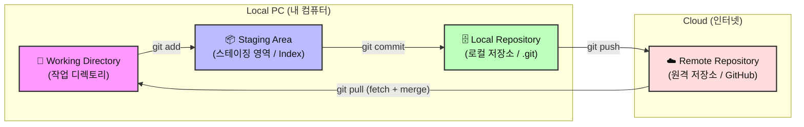
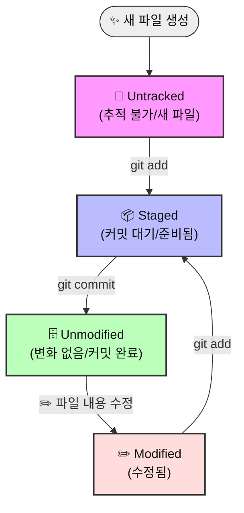
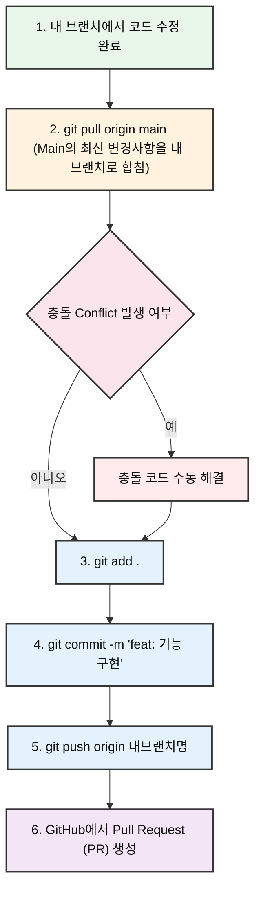
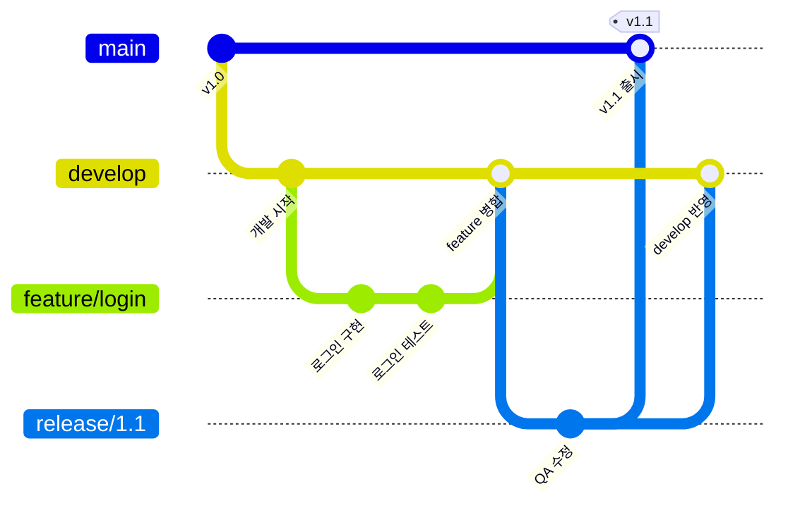

# 🚀 Git & GitHub 협업 가이드: 초보자를 위한 실무 튜토리얼

이 가이드는 Git을 한 번도 사용해 보지 않은 비전공자나 초보자들이 팀 프로젝트에서 **가장 안전하게 협업하는 방법**을 익힐 수 있도록 설계되었습니다. 어려운 이론보다는 **명령어 중심의 실습**과 **협업 시 일어날 수 있는 에러 해결**에 집중합니다.

---

## 📌 목차
1. [🧠 Git의 기본 구조와 4가지 작업 영역](#-git의-기본-구조와-4가지-작업-영역)
2. [GitHub 레포지토리 시작하기](#github-레포지토리-시작하기)
3. [.gitignore: 올리면 안 되는 파일 관리하기](#gitignore-올리면-안-되는-파일-관리하기)
4. [GitHub Issue와 커밋 연결하기 (실무 필수)](#github-issue와-커밋-연결하기-실무-필수)
5. [협업 필수 명령어 & 흐름 (Do's)](#협업-필수-명령어--흐름-dos)
6. [방어적 협업의 핵심: 로컬 브랜치 최신화 흐름](#방어적-협업의-핵심-로컬-브랜치-최신화-흐름)
7. [협업 시 절대 하지 말아야 할 것 (Don'ts)](#협업-시-절대-하지-말아야-할-것-donts)
8. [실전! 협업 에러 시나리오 4선 및 대처법](#실전-협업-에러-시나리오-4선-및-대처법)

---

## 🧠 Git의 기본 구조와 4가지 작업 영역

Git은 파일을 단순히 저장하는 것이 아니라, 파일의 상태를 관리하고 안전하게 전송하기 위해 내부적으로 **4가지 영역**을 나누어 사용합니다. 이 구조를 이해해야 명령어가 왜 나누어져 있는지 이해할 수 있습니다.



### 1. Git의 4대 작업 영역
* **📁 Working Directory (작업 디렉토리)**
  * 사용자가 실제로 코드를 수정하고 새 파일을 만드는 **눈에 보이는 일반 폴더**입니다.
  * 이곳에서의 수정사항은 아직 Git이 관리(기록)하기 전의 상태입니다.
* **📦 Staging Area (스테이징 영역 / Index)**
  * 다음 버전(커밋)에 저장할 변경사항들을 **임시로 모아두는 준비물 상자**입니다.
  * `git add <파일명>`을 실행하면 변경된 파일이 이곳으로 들어갑니다.
  * **왜 굳이 거쳐 가나요?** 작업 폴더에서 10개의 파일을 고쳤어도, 이 중 연관된 3개의 파일만 골라서 묶어 저장(커밋)하고 싶을 때가 있기 때문입니다.
* **🗄️ Local Repository (로컬 저장소 / `.git` 폴더)**
  * 내 컴퓨터에 저장되는 **버전(커밋) 역사 박물관**입니다.
  * `git commit`을 실행하면 스테이징 영역에 대기 중이던 파일들이 하나의 영구적인 버전 카드로 구워져 이곳에 기록됩니다. 인터넷이 연결되어 있지 않아도 컴퓨터 내부에서 이루어집니다.
* **☁️ Remote Repository (원격 저장소 / GitHub)**
  * 팀원들과 공동으로 공유하는 **클라우드 서버 저장소**입니다.
  * `git push`를 실행하면 로컬 저장소에 쌓인 버전 카드들이 인터넷을 통해 GitHub으로 전송됩니다.

---

### 🔄 파일의 상태 변화 (Life Cycle)
Working Directory에 있는 파일들은 생성되고 수정됨에 따라 Git에 의해 아래와 같이 상태(State)가 바뀝니다.



* **Untracked (추적 불가)**: 새로 만든 파일이라 Git이 감시를 시작하지 않은 상태
* **Tracked (추적 중)**: Git이 한 번이라도 기록해 본 파일이며, 상태가 3가지로 나뉩니다.
  * **Unmodified (변화 없음)**: 최신 커밋 상태와 정확히 똑같아 아무 수정도 없는 상태
  * **Modified (수정됨)**: 코드가 고쳐졌으나 아직 커밋 준비물 상자(`add`)에 넣지 않은 상태
  * **Staged (준비됨)**: 코드가 수정되어 커밋 상자(`add`)에 들어가 커밋을 대기 중인 상태

---

### 💻 실제 예시로 보는 파일 상태 변화 흐름

터미널에서 `git status`(현재 파일들의 상태 확인) 명령어를 입력했을 때 나타나는 변화와 함께 매핑해서 이해해 봅시다.

#### 1단계: 🆕 새 파일 생성 (Untracked)
* **어떤 상태인가요?** 에디터에서 `hello.txt`라는 새로운 파일을 만들고 저장했을 때입니다.
* **`git status` 입력 시**:
  * 빨간색 글씨로 `Untracked files:` 목록에 `hello.txt`가 노출됩니다.
  * *이 상태에서는 컴퓨터가 꺼지거나 파일이 날아가도 Git이 복구해 주지 못합니다.*

#### 2단계: 📦 커밋 대기 상자에 담기 (Staged)
* **어떻게 하나요?** `git add hello.txt` 명령어를 실행합니다.
* **`git status` 입력 시**:
  * 초록색 글씨로 `Changes to be committed:` 목록 아래에 `new file: hello.txt`로 바뀝니다.
  * 다음 버전에 저장할 준비가 끝난 상태입니다.

#### 3단계: 🗄️ 영구 보관소에 저장 완료 (Unmodified)
* **어떻게 하나요?** `git commit -m "feat: hello 파일 추가"` 명령어를 실행합니다.
* **`git status` 입력 시**:
  * `nothing to commit, working tree clean` (커밋할 변경사항 없음)이 뜹니다.
  * 버전 기록에 영구 박제되어, 변경이 하나도 없는 가장 깨끗하고 안전한 상태가 됩니다.

#### 4단계: ✏️ 기존 파일 수정 (Modified)
* **어떤 상태인가요?** 보관소에 잘 저장되어 있던 `hello.txt`를 다시 열어 글자 몇 개를 수정하고 저장했을 때입니다.
* **`git status` 입력 시**:
  * 다시 빨간색 글씨로 `Changes not staged for commit:` 목록 아래에 `modified: hello.txt`가 뜹니다.
  * Git이 "너 기존 파일 내용 고쳤네? 그런데 아직 커밋 상자(Staged)에는 안 담았어!"라고 말해주는 상태입니다.
  * 이 변경 사항을 다시 저장하고 싶다면 **2단계(`git add`)**부터 반복해야 합니다.

---

## GitHub 레포지토리 시작하기

팀 프로젝트를 시작하기 위해 원격 저장소(GitHub)를 만들고 내 컴퓨터(Local)로 가져오는 과정입니다.

### 1단계: GitHub에서 저장소(Repository) 만들기
1. [GitHub](https://github.com)에 로그인 후, 우측 상단의 **[+]** 버튼 ➔ **New repository** 선택
2. **Repository name** 설정 (예: `our-team-project`)
3. **Public**(공개) 또는 **Private**(비공개) 선택
4. ⚠️ **Add a README file** 체크 (저장소 생성 후 바로 클론받기 편리합니다.)
5. **Create repository** 버튼 클릭!

### 2단계: 내 컴퓨터로 복제(Clone)하기
생성된 GitHub 페이지에서 초록색 **[Code]** 버튼을 누르고 **HTTPS** 탭의 주소(URL)를 복사합니다.

컴퓨터의 터미널(Git Bash, 터미널 등)을 열고 프로젝트를 저장할 폴더로 이동한 뒤 아래 명령어를 입력합니다.
```bash
# GitHub 저장소를 내 컴퓨터로 다운로드
git clone <복사한_저장소_URL>

# 다운로드된 폴더 안으로 이동
cd <저장소_폴더명>
```

---

## .gitignore: 올리면 안 되는 파일 관리하기

프로젝트 폴더에는 GitHub에 **절대 올리면 안 되는 파일**들이 존재합니다. 대표적으로 API 키가 담긴 환경 변수 파일(`.env`), 수천 개의 라이브러리가 들어 있는 의존성 폴더(`node_modules/`), 빌드 결과물(`dist/`) 등이 있습니다.

`.gitignore` 파일을 프로젝트 최상위 폴더에 만들어 두면, Git이 해당 파일들을 **자동으로 무시**하여 실수로 GitHub에 올라가는 것을 방지합니다.

### 1단계: `.gitignore` 파일 만들기
프로젝트 최상위 폴더(`.git` 폴더가 있는 곳)에 `.gitignore`라는 이름의 파일을 생성합니다.

### 2단계: 무시할 파일/폴더 목록 작성하기
`.gitignore` 파일 안에 무시할 대상을 한 줄에 하나씩 적습니다.
```
# 환경 변수 파일 (API 키, DB 비밀번호 등 민감 정보)
.env
.env.local

# 의존성 폴더 (npm, pip 등으로 설치한 라이브러리)
node_modules/
__pycache__/
venv/

# 빌드 결과물
dist/
build/

# OS 자동 생성 파일
.DS_Store
Thumbs.db

# IDE 설정 파일
.vscode/settings.json
.idea/
```

### 자주 쓰이는 `.gitignore` 패턴

| 패턴 | 의미 | 예시 |
|---|---|---|
| `파일명` | 정확히 그 이름의 파일 무시 | `.env` |
| `폴더명/` | 해당 폴더 전체 무시 | `node_modules/` |
| `*.확장자` | 해당 확장자 파일 전부 무시 | `*.log` |
| `!파일명` | 위에서 무시했어도 이 파일만 예외 추적 | `!important.log` |

> [!CAUTION]
> **이미 한 번이라도 `git add`로 추적된 파일**은 나중에 `.gitignore`에 추가해도 계속 추적됩니다! 추적을 해제하려면 아래 명령어를 실행하세요:
> ```bash
> # Git의 추적 목록에서만 제거 (실제 파일은 삭제되지 않음)
> git rm --cached <파일명>
> git commit -m "chore: .gitignore에 따라 추적 해제"
> ```

> [!TIP]
> 프로젝트 언어별 `.gitignore` 템플릿은 [github.com/github/gitignore](https://github.com/github/gitignore)에서 바로 복사할 수 있습니다. Node.js, Python, Java 등 주요 언어별 추천 목록이 깔끔하게 정리되어 있습니다.

---

## GitHub Issue와 커밋 연결하기 (실무 필수)

실무 프로젝트에서는 코드를 먼저 짜는 것이 아니라, **"내가 오늘 어떤 일을 할지"를 GitHub Issue에 먼저 등록**하고 작업을 시작합니다. 이 이슈 번호를 커밋에 연결하면 전체 개발 이력이 추적 가능해집니다.

### 1단계: GitHub Issue 만들기
1. GitHub 저장소의 **Issues** 탭 ➔ **New issue** 클릭
2. 구현할 기능이나 버그 내용을 적고 등록합니다. (이때 생성된 이슈 제목 옆의 번호를 확인합니다. 예: `#12`)

### 2단계: 이슈 번호와 커밋 메시지 연결하기
코드를 작성하고 커밋할 때 메시지에 **`[#이슈번호]`**를 적어주면 GitHub이 자동으로 해당 이슈 페이지에 이 커밋을 등록해 줍니다.
```bash
# 이슈 #12와 로그인 기능 개발 커밋 연결 예시
git commit -m "[#12] feat: 로그인 페이지 이메일 입력 폼 구현"
```
이렇게 하면 나중에 GitHub 이슈 화면에서 어떤 커밋들이 해당 업무를 위해 수정되었는지 모아볼 수 있어 이력 관리가 매우 편해집니다.

### 3단계: PR 머지 시 이슈 자동으로 닫기 (Auto-Close)
개인 브랜치 작업을 마치고 Pull Request를 보낼 때, PR 설명(Description)에 특정 키워드와 이슈 번호를 적어주면 **PR이 최종 머지되는 순간 해당 이슈가 자동으로 Closed 상태로 변경**됩니다.
* **사용 가능 키워드**: `closes`, `resolves`, `fixes`
* **설명 예시**:
  > 이 PR은 로그인 이메일 폼을 구현한 작업입니다.  
  > **Closes #12**

---

## 협업 필수 명령어 & 흐름 (Do's)

협업할 때 핵심은 **"메인 코드(main/master)를 직접 건드리지 않고, 각자의 방(Branch)에서 작업한 뒤 합치는 것"**입니다.

### 💡 딱 6개만 기억하는 핵심 명령어

| # | 정석 명령어 | 실전 단축 | 설명 |
|:-:|---|---|---|
| 1 | `git branch <브랜치명>` | — | 새로운 작업 방(가지) 만들기 |
| 2 | `git switch <브랜치명>` | `git checkout <브랜치명>` | 작업할 방으로 들어가기 |
| 3 | `git pull origin <브랜치명>` | — | 원격 저장소의 최신 코드 가져오기 |
| 4 | `git add <파일명>` | `git add .` (전체) | 변경된 파일 올릴 준비 하기 |
| 5 | `git commit -m "메시지"` | `git commit -am "메시지"` | 준비된 파일에 설명 적고 저장하기 |
| 6 | `git push origin <브랜치명>` | — | 내 방의 변경사항을 GitHub에 올리기 |

### 🔀 자주 쓰는 조합 단축키

| 하고 싶은 일 | 정석 (2단계) | 실전 단축 (1단계) |
|---|---|---|
| 브랜치 **만들면서 바로 이동** | `git branch 이름` → `git switch 이름` | **`git switch -c 이름`** |
| ↑ 같은 동작 (옛날 방식) | `git branch 이름` → `git checkout 이름` | **`git checkout -b 이름`** |
| 수정된 파일 **add + commit 동시에** | `git add .` → `git commit -m "메시지"` | **`git commit -am "메시지"`** |
| 파일 수정 **되돌리기** (커밋 전) | — | **`git restore <파일명>`** |

> [!NOTE]
> **`git checkout`과의 관계**: 인터넷 검색이나 오래된 강의에서 `git checkout`이라는 명령어를 자주 보게 됩니다. `checkout`은 과거에 **브랜치 전환 + 파일 복원**을 혼자서 전부 처리하던 명령어인데, 역할이 너무 많아 헷갈린다는 이유로 Git 2.23(2019) 버전부터 **`git switch`**(브랜치 전환)와 **`git restore`**(파일 복원)로 분리되었습니다. 이 가이드에서는 최신 권장 명령어인 `switch`를 사용하지만, 위 표처럼 `checkout` 대응 명령어도 함께 표기해 두었으니 참고하세요.
>
> | 새 명령어 | 옛 명령어 (`checkout`) | 역할 |
> |---|---|---|
> | `git switch <브랜치>` | `git checkout <브랜치>` | 브랜치 전환 |
> | `git switch -c <브랜치>` | `git checkout -b <브랜치>` | 브랜치 생성 + 전환 |
> | `git restore <파일>` | `git checkout -- <파일>` | 파일 수정 되돌리기 |

---

## 방어적 협업의 핵심: 로컬 브랜치 최신화 흐름

여러 사람이 동시에 같은 프로젝트를 수정하다 보면, 내가 코드를 짜는 사이에 동료가 이미 코드를 업데이트하여 GitHub에 올려버려서 내 push가 거절당하는 동기화 문제가 발생합니다. 

이를 예방하고 충돌을 최소화하는 **가장 안전한 커밋/푸시 흐름**입니다.



### ⚙️ 로컬 브랜치 최신화 가이드 (명령어)
작업 브랜치(`feature/login`)에서 기능 개발을 완료했다고 가정합니다.

```bash
# 1. 원격 main의 최신 상태를 내 작업 브랜치로 끌어와 합칩니다. (로컬 브랜치 최신화)
#    ⚠️ main으로 이동하지 않고 현재 feature 브랜치에서 실행합니다!
#    → main의 최신 내용이 내 작업 브랜치에 합쳐(merge)집니다.
git pull origin main

# 2. 변경된 파일들을 올릴 준비물 바구니에 담습니다.
git add .

# 3. 무엇을 개발했는지 친절하게 적어서 박스를 포장합니다.
git commit -m "feat: 로그인 페이지 이메일 유효성 검사 추가"

# 4. 내 작업 브랜치를 GitHub에 업로드합니다.
git push origin feature/login
```
> [!IMPORTANT]
> **Push 완료 후**: GitHub 레포지토리 페이지로 이동하여 **[Compare & pull request]** 버튼을 눌러 동료들에게 검토를 요청(PR)하는 것이 협업의 기본 매너입니다.

---

## 협업 시 절대 하지 말아야 할 것 (Don'ts)

팀원의 정신 건강과 프로젝트 평화를 위해 아래 행동은 반드시 지양해야 합니다.

* **❌ 확실하지 않은 코드를 `main`/`master` 브랜치에 직접 푸시(Push)하지 않기**
  * `main` 브랜치는 언제든 사용자에게 배포 가능한 "안전한 코드"만 있어야 합니다.
  * 반드시 개인 브랜치를 만들어 작업하고, 팀원의 리뷰(PR)를 거친 후 병합해야 합니다.
* **❌ `git push origin main -f` (강제 푸시) 절대 금지**
  * 강제 푸시는 동료들이 작성한 GitHub의 커밋 역사를 덮어써서 날려버립니다. 대형 사고의 지름길입니다.
* **❌ 하루 종일 Pull 받지 않고 혼자 코딩하기**
  * 아침에 출근하거나 작업을 시작할 때는 항상 `git pull`을 먼저 받아 프로젝트 최신 상태를 유지하세요. 늦게 Pull을 받을수록 충돌의 고통이 커집니다.

---

## 실전! 협업 에러 시나리오 4선 및 대처법

초보자들이 협업할 때 가장 많이 겪고 당황하는 대표적인 상황 3가지와 해결법입니다.

### 🚨 시나리오 1: 같은 파일을 수정해서 충돌(Conflict)이 났을 때
> **상황**: 나도 `index.html`을 수정했고, 동료도 `index.html`을 수정해서 올렸습니다. `git pull`을 하니 아래와 같은 메시지가 뜹니다.
> `CONFLICT (content): Merge conflict in index.html`

#### 💡 해결법: VS Code/IDE의 충돌 해결 버튼 사용하기 (권장)
1. 충돌이 발생한 파일(`index.html`)을 코드 에디터(VS Code 등)로 엽니다.
2. 충돌이 난 코드 구간에 색상이 칠해지며 상단에 다음과 같은 선택 버튼(GUI)이 제공됩니다.
   * **Accept Current Change** (내 코드 유지): 내가 로컬에서 작성한 코드만 남기고 상대방 코드는 지웁니다.
   * **Accept Incoming Change** (동료 코드 유지): 내가 작성한 것은 지우고 GitHub에서 가져온 동료의 코드로 대체합니다.
   * **Accept Both Changes** (둘 다 유지): 내 코드와 동료 코드를 위아래로 둘 다 남깁니다.
3. 두 코드를 조율하여 **가장 알맞은 버튼을 클릭**합니다. 클릭하는 순간 `<<<<<<<`, `=======`, `>>>>>>>` 같은 지저분한 특수 기호들이 자동으로 깔끔하게 지워집니다.
4. (직접 편집이 필요한 경우) 기호들을 직접 지우면서 조화롭게 코드를 타이핑해 줍니다.
5. 파일을 저장한 후 아래 명령어로 마무리합니다.
   ```bash
   git add index.html
   git commit -m "fix: index.html 충돌 해결"
   git push origin 내브랜치명
   ```

---

### 🚨 시나리오 2: 깜빡하고 `main` 브랜치에서 직접 코드를 수정해버렸을 때
> **상황**: 브랜치를 새로 안 만들고 메인 브랜치(`main`)에서 신나게 코드를 짜고 저장해 버렸습니다. 아직 커밋(`commit`)은 안 한 상태입니다.

#### 💡 해결법 (커밋 전이라면 가장 간단함):
현재 변경사항을 그대로 가지고 새로운 브랜치를 만들며 탈출하면 됩니다!
```bash
# 1. 변경사항을 유지한 채로 새 브랜치를 만들어 이동합니다.
git switch -c feature/new-work

# 2. 이제 안전한 내 방이 생겼으니 정상적으로 진행합니다.
git add .
git commit -m "feat: 새 기능 구현"
git push origin feature/new-work
```

> **만약 실수로 `main` 브랜치에서 커밋까지 완료해버렸다면?**
> ⚠️ **주의**: 아래 `reset --hard`는 커밋되지 않은 변경사항을 **모두 삭제**하는 위험한 명령어입니다. **반드시 1번(브랜치 생성)을 먼저 실행**하여 작업을 보존한 뒤에 2번을 실행하세요!
> ```bash
> # 1. 현재 커밋이 완료된 상태에서 임시 브랜치를 새로 만듭니다. (내 작업 보존) ← 반드시 먼저!
> git branch feature/my-saved-work
> 
> # 2. 로컬 main 브랜치를 GitHub에 저장된 최신 상태(원격 상태)로 강제 되돌립니다.
> git reset --hard origin/main
> 
> # 3. 보존해 둔 내 작업 브랜치로 이동합니다.
> git switch feature/my-saved-work
> ```

---

### 🚨 시나리오 3: `git pull`을 안 하고 수정한 뒤 push 하려다가 거부당했을 때
> **상황**: 내 브랜치에서 작업을 마쳐서 푸시하려는데 다음과 같은 에러와 함께 거절당합니다.
> `[rejected] - non-fast-forward / fetch first`

#### 💡 해결법:
GitHub에 누군가 내가 없던 사이에 코드를 올려서 그렇습니다. 당황하지 말고 원격 코드를 합친 후 다시 보내면 됩니다.
```bash
# 1. 일단 원격의 변경 사항을 내 브랜치로 끌어와 병합합니다.
git pull origin main

# (이때 시나리오 1처럼 충돌이 발생하면 충돌을 해결해 줍니다.)

# 2. 병합이 완료되었거나 충돌을 해결했다면 다시 푸시합니다.
git push origin 내브랜치명
```

---

### 🚨 시나리오 4: 이미 GitHub에 Push한 커밋을 되돌려야 할 때
> **상황**: 버그가 있는 코드를 커밋하고 push까지 완료해 버렸습니다. 해당 커밋을 없었던 일로 만들고 싶습니다.

#### ❌ 절대 하면 안 되는 방법
```bash
# 이미 push한 커밋을 강제로 덮어쓰는 방법 — 팀원들의 커밋 기록 손실 위험!
git reset --hard <커밋해시>
git push -f origin main   # ← 절대 금지!
```

#### 💡 해결법: `git revert` (안전한 되돌리기)
`git revert`는 실수한 커밋의 변경사항을 **정반대로 적용하는 새로운 커밋**을 만들어, 기존 기록을 보존하면서 안전하게 되돌립니다.

```bash
# 1. 되돌리고 싶은 커밋의 해시(ID)를 확인합니다.
git log --oneline -5

# 예시 결과:
# abc1234 feat: 버그 있는 기능 추가  ← 이걸 되돌리고 싶다면
# def5678 docs: README 수정
# ...

# 2. 해당 커밋을 되돌리는 새 커밋을 생성합니다.
git revert abc1234

# 3. 에디터가 열리면 커밋 메시지를 확인하고 저장합니다. (기본 메시지 그대로 사용 OK)

# 4. 되돌린 결과를 GitHub에 올립니다.
git push origin 내브랜치명
```

> [!NOTE]
> **`reset` vs `revert` 핵심 차이**
>
> | | `git reset` | `git revert` |
> |---|---|---|
> | 동작 | 커밋 기록을 **삭제** | 되돌리는 **새 커밋 생성** |
> | 기록 보존 | ❌ 사라짐 | ✅ 유지됨 |
> | Push된 커밋에 사용 | ⚠️ `-f` 강제 푸시 필요 (위험) | ✅ 안전하게 사용 가능 |
> | 협업 시 권장 | ❌ 비추천 | ✅ **항상 이것을 사용** |

---

## 📎 부록: 실무에서 쓰이는 브랜치 전략 — Git Flow

이 가이드에서는 `main` + `feature` 브랜치만 사용하는 단순한 워크플로우를 배웠습니다. 실무에서는 프로젝트 규모가 커지면 더 체계적인 브랜치 관리 전략을 사용하는데, 그 중 가장 유명한 것이 **Git Flow**입니다.



### 5가지 브랜치 한 줄 요약

| 브랜치 | 역할 | 비유 |
|---|---|---|
| `main` | 출시된 코드만 모아두는 곳 | 🏪 매장 진열대 |
| `develop` | 다음 버전을 준비하는 곳 | 🏗️ 공사 현장 |
| `feature/*` | 새 기능 하나를 만드는 곳 | 🧑‍💻 각자의 작업 책상 |
| `release/*` | 출시 직전 마무리/QA | 🔍 품질 검사대 |
| `hotfix/*` | 출시 후 긴급 버그 수정 | 🚒 소방차 |

> [!TIP]
> 처음에는 이 가이드에서 배운 `main` + `feature` 브랜치 워크플로우로 충분합니다. 팀 규모가 커지거나 배포 주기가 생기면 그때 Git Flow 도입을 검토하세요. 더 자세한 내용은 👉 [Git Flow 완벽 가이드](./git_flow_guide.md)를 참고하세요.
