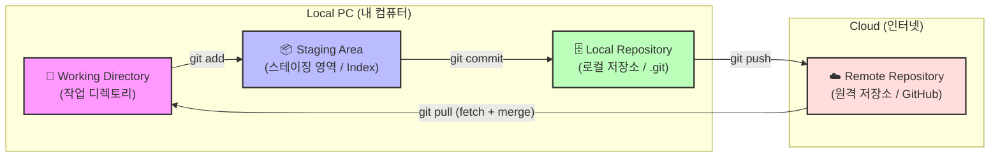
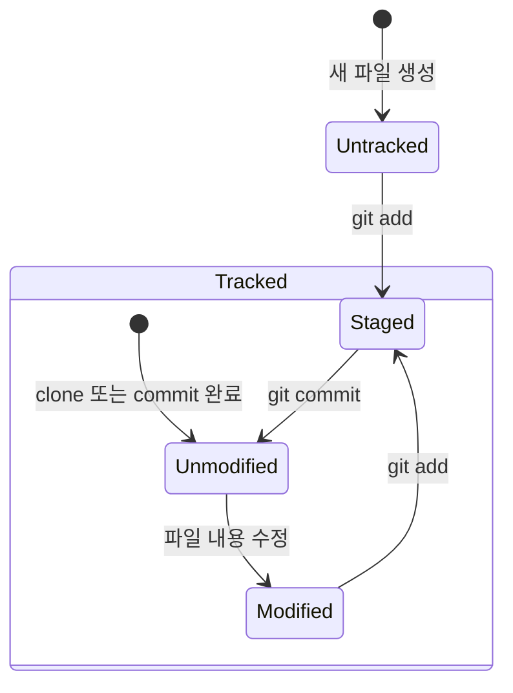
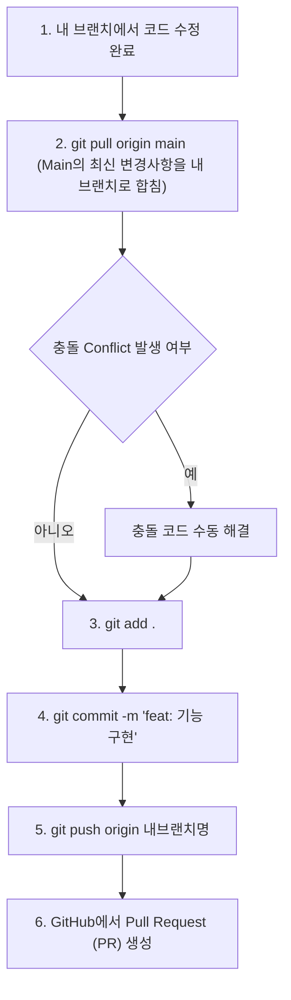

# 🚀 Git & GitHub 협업 가이드: 초보자를 위한 실무 튜토리얼

이 가이드는 Git을 한 번도 사용해 보지 않은 비전공자나 초보자들이 팀 프로젝트에서 **가장 안전하게 협업하는 방법**을 익힐 수 있도록 설계되었습니다. 어려운 이론보다는 **명령어 중심의 실습**과 **협업 시 일어날 수 있는 에러 해결**에 집중합니다.

---

## 📌 목차
1. [🧠 Git의 기본 구조와 4가지 작업 영역](#-git의-기본-구조와-4가지-작업-영역)
2. [GitHub 레포지토리 시작하기](#1-github-레포지토리-시작하기)
3. [협업 필수 명령어 & 흐름 (Do's)](#2-협업-필수-명령어--흐름-dos)
4. [방어적 협업의 핵심: 로컬 브랜치 최신화 흐름](#3-방어적-협업의-핵심-로컬-브랜치-최신화-흐름)
5. [협업 시 절대 하지 말아야 할 것 (Don'ts)](#4-협업-시-절대-하지-말아야-할-것-donts)
6. [실전! 협업 에러 시나리오 3선 및 대처법](#5-실전-협업-에러-시나리오-3선-및-대처법)

---

## 🧠 Git의 기본 구조와 4가지 작업 영역

Git은 파일을 단순히 저장하는 것이 아니라, 파일의 상태를 관리하고 안전하게 전송하기 위해 내부적으로 **4가지 영역**을 나누어 사용합니다. 이 구조를 이해해야 명령어가 왜 나누어져 있는지 이해할 수 있습니다.



### 1. Git의 4대 작업 영역
* **📁 Working Directory (작업 디렉토리)**
  * 사용자가 실제로 코드를 수정하고 새 파일을 만드는 **눈에 보이는 일반 폴더**입니다.
  * 이곳에서의 수정사항은 아직 Git이 관리(기록)하기 전의 상태입니다.
* **📦 Staging Area (스테이징 영역 / Index)**
  * 다음 버전(커밋)에 저장할 변경사항들을 **임시로 모아두는 준비물 상자**입니다.
  * `git add <파일명>`을 실행하면 변경된 파일이 이곳으로 들어갑니다.
  * **왜 굳이 거쳐 가나요?** 작업 폴더에서 10개의 파일을 고쳤어도, 이 중 연관된 3개의 파일만 골라서 묶어 저장(커밋)하고 싶을 때가 있기 때문입니다.
* **🗄️ Local Repository (로컬 저장소 / `.git` 폴더)**
  * 내 컴퓨터에 저장되는 **버전(커밋) 역사 박물관**입니다.
  * `git commit`을 실행하면 스테이징 영역에 대기 중이던 파일들이 하나의 영구적인 버전 카드로 구워져 이곳에 기록됩니다. 인터넷이 연결되어 있지 않아도 컴퓨터 내부에서 이루어집니다.
* **☁️ Remote Repository (원격 저장소 / GitHub)**
  * 팀원들과 공동으로 공유하는 **클라우드 서버 저장소**입니다.
  * `git push`를 실행하면 로컬 저장소에 쌓인 버전 카드들이 인터넷을 통해 GitHub으로 전송됩니다.

---

### 🔄 파일의 상태 변화 (Life Cycle)
Working Directory에 있는 파일들은 Git에 의해 아래와 같이 상태(State)가 바뀝니다.



* **Untracked (추적 불가)**: 새로 만든 파일이라 Git이 감시를 시작하지 않은 상태
* **Tracked (추적 중)**: Git이 한 번이라도 기록해 본 파일이며, 상태가 3가지로 나뉩니다.
  * **Unmodified (변화 없음)**: 최신 커밋 상태와 정확히 똑같아 아무 수정도 없는 상태
  * **Modified (수정됨)**: 코드가 고쳐졌으나 아직 커밋 준비물 상자(`add`)에 넣지 않은 상태
  * **Staged (준비됨)**: 코드가 수정되어 커밋 상자(`add`)에 들어가 커밋을 대기 중인 상태

---


## 1. GitHub 레포지토리 시작하기

팀 프로젝트를 시작하기 위해 원격 저장소(GitHub)를 만들고 내 컴퓨터(Local)로 가져오는 과정입니다.

### 1단계: GitHub에서 저장소(Repository) 만들기
1. [GitHub](https://github.com)에 로그인 후, 우측 상단의 **[+]** 버튼 ➔ **New repository** 선택
2. **Repository name** 설정 (예: `our-team-project`)
3. **Public**(공개) 또는 **Private**(비공개) 선택
4. ⚠️ **Add a README file** 체크 (저장소 생성 후 바로 클론받기 편리합니다.)
5. **Create repository** 버튼 클릭!

### 2단계: 내 컴퓨터로 복제(Clone)하기
생성된 GitHub 페이지에서 초록색 **[Code]** 버튼을 누르고 **HTTPS** 탭의 주소(URL)를 복사합니다.

컴퓨터의 터미널(Git Bash, 터미널 등)을 열고 프로젝트를 저장할 폴더로 이동한 뒤 아래 명령어를 입력합니다.
```bash
# GitHub 저장소를 내 컴퓨터로 다운로드
git clone <복사한_저장소_URL>

# 다운로드된 폴더 안으로 이동
cd <저장소_폴더명>
```

---

## 2. 협업 필수 명령어 & 흐름 (Do's)

협업할 때 핵심은 **"메인 코드(main/master)를 직접 건드리지 않고, 각자의 방(Branch)에서 작업한 뒤 합치는 것"**입니다.

### 💡 딱 5개만 기억하는 핵심 명령어
1. **`git branch <브랜치명>`**: 새로운 작업 방(가지) 만들기
2. **`git switch <브랜치명>`** (또는 `checkout`): 작업할 방으로 들어가기
3. **`git pull origin <브랜치명>`**: 원격 저장소의 최신 코드 내 컴퓨터로 가져오기
4. **`git add <파일명>`** (또는 `git add .`): 변경된 파일 올릴 준비 하기
5. **`git commit -m "메시지"`**: 준비된 파일에 설명 적고 저장하기
6. **`git push origin <브랜치명>`**: 내 방의 변경사항을 GitHub에 올리기

---

## 3. 방어적 협업의 핵심: 로컬 브랜치 최신화 흐름

여러 사람이 동시에 같은 프로젝트를 수정하다 보면, 내가 코드를 짜는 사이에 동료가 이미 코드를 업데이트하여 GitHub에 올려버려서 내 push가 거절당하는 동기화 문제가 발생합니다. 

이를 예방하고 충돌을 최소화하는 **가장 안전한 커밋/푸시 흐름**입니다.



### ⚙️ 로컬 브랜치 최신화 가이드 (명령어)
작업 브랜치(`feature/login`)에서 기능 개발을 완료했다고 가정합니다.

```bash
# 1. 원격 main의 최신 상태를 내 작업 브랜치로 끌어와 합칩니다. (로컬 브랜치 최신화)
git pull origin main

# 2. 변경된 파일들을 올릴 준비물 바구니에 담습니다.
git add .

# 3. 무엇을 개발했는지 친절하게 적어서 박스를 포장합니다.
git commit -m "feat: 로그인 페이지 이메일 유효성 검사 추가"

# 4. 내 작업 브랜치를 GitHub에 업로드합니다.
git push origin feature/login
```
> [!IMPORTANT]
> **Push 완료 후**: GitHub 레포지토리 페이지로 이동하여 **[Compare & pull request]** 버튼을 눌러 동료들에게 검토를 요청(PR)하는 것이 협업의 기본 매너입니다.

---

## 4. 협업 시 절대 하지 말아야 할 것 (Don'ts)

팀원의 정신 건강과 프로젝트 평화를 위해 아래 행동은 반드시 지양해야 합니다.

* **❌ 확실하지 않은 코드를 `main`/`master` 브랜치에 직접 푸시(Push)하지 않기**
  * `main` 브랜치는 언제든 사용자에게 배포 가능한 "안전한 코드"만 있어야 합니다.
  * 반드시 개인 브랜치를 만들어 작업하고, 팀원의 리뷰(PR)를 거친 후 병합해야 합니다.
* **❌ `git push origin main -f` (강제 푸시) 절대 금지**
  * 강제 푸시는 동료들이 작성한 GitHub의 커밋 역사를 덮어써서 날려버립니다. 대형 사고의 지름길입니다.
* **❌ 하루 종일 Pull 받지 않고 혼자 코딩하기**
  * 아침에 출근하거나 작업을 시작할 때는 항상 `git pull`을 먼저 받아 프로젝트 최신 상태를 유지하세요. 늦게 Pull을 받을수록 충돌의 고통이 커집니다.

---

## 5. 실전! 협업 에러 시나리오 3선 및 대처법

초보자들이 협업할 때 가장 많이 겪고 당황하는 대표적인 상황 3가지와 해결법입니다.

### 🚨 시나리오 1: 같은 파일을 수정해서 충돌(Conflict)이 났을 때
> **상황**: 나도 `index.html`을 수정했고, 동료도 `index.html`을 수정해서 올렸습니다. `git pull`을 하니 아래와 같은 메시지가 뜹니다.
> `CONFLICT (content): Merge conflict in index.html`

#### 💡 해결법:
1. 에러가 난 파일(`index.html`)을 코드 에디터(VS Code 등)로 엽니다.
2. 코드 내부에 아래와 같은 충돌 표시가 보입니다.
   ```html
   <<<<<<< HEAD
   <button class="btn-blue">내 로그인 버튼</button>
   =======
   <button class="btn-green">동료가 바꾼 로그인 버튼</button>
   >>>>>>> main
   ```
   * **`<<<<<<< HEAD` 부터 `=======` 까지**: 내가 작성한 코드
   * **`=======` 부터 `>>>>>>> main` 까지**: 동료가 작성해서 올라온 코드
3. 두 코드를 조율하여 **남길 코드만 남기고 저 특수 기호들(`<<<`, `===`, `>>>`)을 모두 지웁니다.**
4. 파일을 저장한 후 아래 명령어로 마무리합니다.
   ```bash
   git add index.html
   git commit -m "fix: index.html 충돌 해결"
   git push origin 내브랜치명
   ```

---

### 🚨 시나리오 2: 깜빡하고 `main` 브랜치에서 직접 코드를 수정해버렸을 때
> **상황**: 브랜치를 새로 안 만들고 메인 브랜치(`main`)에서 신나게 코드를 짜고 저장해 버렸습니다. 아직 커밋(`commit`)은 안 한 상태입니다.

#### 💡 해결법 (커밋 전이라면 가장 간단함):
현재 변경사항을 그대로 가지고 새로운 브랜치를 만들며 탈출하면 됩니다!
```bash
# 1. 변경사항을 유지한 채로 새 브랜치를 만들어 이동합니다.
git switch -c feature/new-work

# 2. 이제 안전한 내 방이 생겼으니 정상적으로 진행합니다.
git add .
git commit -m "feat: 새 기능 구현"
git push origin feature/new-work
```

> **만약 실수로 `main` 브랜치에서 커밋까지 완료해버렸다면?**
> ```bash
> # 1. 현재 커밋이 완료된 상태에서 임시 브랜치를 새로 만듭니다. (내 작업 보존)
> git branch feature/my-saved-work
> 
> # 2. 로컬 main 브랜치를 GitHub에 저장된 최신 상태(원격 상태)로 강제 되돌립니다.
> git reset --hard origin/main
> 
> # 3. 보존해 둔 내 작업 브랜치로 이동합니다.
> git switch feature/my-saved-work
> ```

---

### 🚨 시나리오 3: `git pull`을 안 하고 수정한 뒤 push 하려다가 거부당했을 때
> **상황**: 내 브랜치에서 작업을 마쳐서 푸시하려는데 다음과 같은 에러와 함께 거절당합니다.
> `[rejected] - non-fast-forward / fetch first`

#### 💡 해결법:
GitHub에 누군가 내가 없던 사이에 코드를 올려서 그렇습니다. 당황하지 말고 원격 코드를 합친 후 다시 보내면 됩니다.
```bash
# 1. 일단 원격의 변경 사항을 내 브랜치로 끌어와 병합합니다.
git pull origin main

# (이때 시나리오 1처럼 충돌이 발생하면 충돌을 해결해 줍니다.)

# 2. 병합이 완료되었거나 충돌을 해결했다면 다시 푸시합니다.
git push origin 내브랜치명
```
